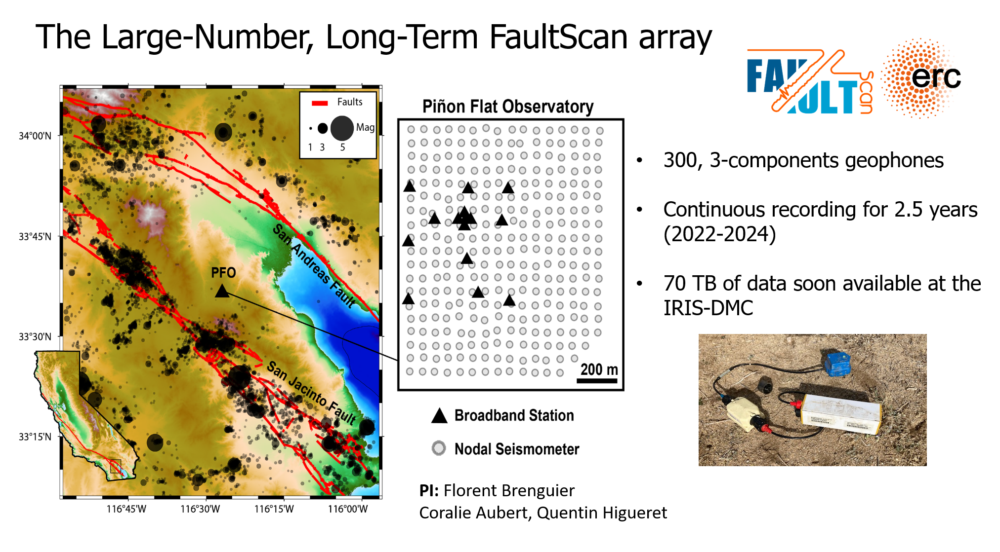

{: .align-right width="350px"}
I am a Ph.D. candidate in Seismology at University Grenoble Alpes, working at [ISTerre](https://www.isterre.fr/?lang=en). My research focuses on two main areas. First, I conduct long-term experiments with dense nodal arrays as part of the ERC-funded [Faultscan](https://sites.google.com/site/florentbrenguier/Home/research/faultscan-2019-2024) project, a pioneering effort involving the deployment of 300 seismic stations near the San Jacinto Fault (CA). This work facilitates an in-depth analysis of microseismicity and the temporal evolution of fault processes. Based on an incredible signal-to-noise ratio (SNR) achieved through these experiments, I aim to uncover patterns in seismicity, as well as potential tremor signals, to gain insights into fluid migration and slow-slip events.

The second aspect of my research focuses on noise-based monitoring and body-wave modeling. I reconstruct body waves using noise correlation functions, utilizing passing freight trains as seismic sources to monitor temporal velocity variations at depth along the San Jacinto Fault (CA). Through modeling these correlations, I simulate waveform interactions that reflect the fault's influence on seismic velocity variations, providing potential explanations for observed changes.
